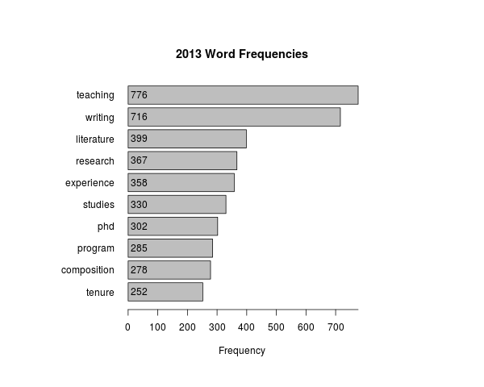
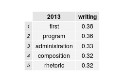
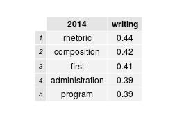
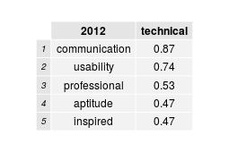

##MLA JIL Writing Studies Analysis

This report is a summary of job description data from the MLA Jobs Information Lists. The job descriptions were separated into separate text files, and then these files were data mined for word frequency and correlation data.

