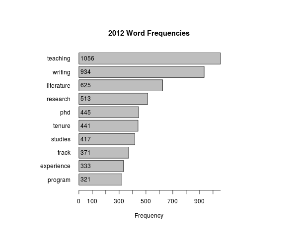
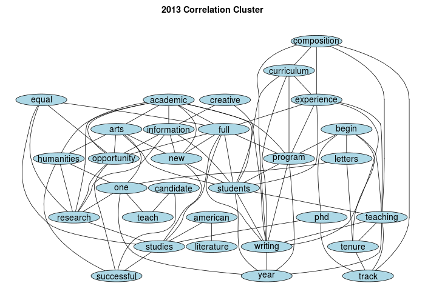
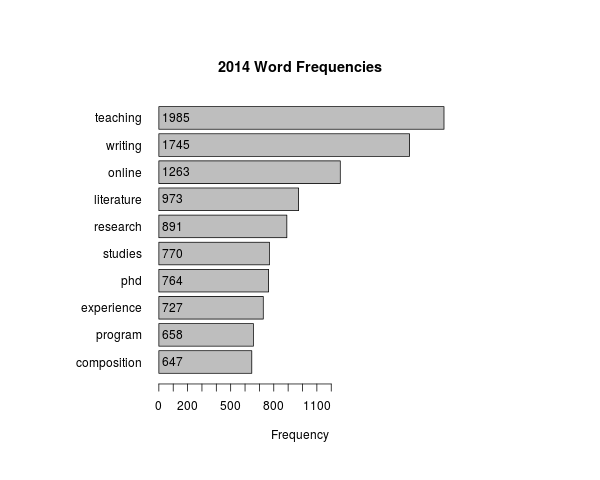
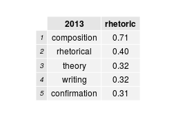
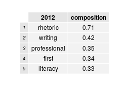

##MLA JIL Writing Studies Analysis

This report is a summary of job description data from the MLA Jobs Information Lists. The job descriptions were separated into a corpus of separate text files---one plain text file for each job description. There is a corpus of job description texts available for 2012, 2013, and 2014. I intend to continue adding to this text archive slowly--working both backwards and forwards. So each new year of MLA job descriptions will be added when they are released by the MLA, and then I'll also continue working into the past.

The Readme file in my [GitHub repository](http:github.com/aaronbev79/mla_data) explains how this data was collected and processed for analysis.  

####Correlation Data
The following tables display word correlation data.

